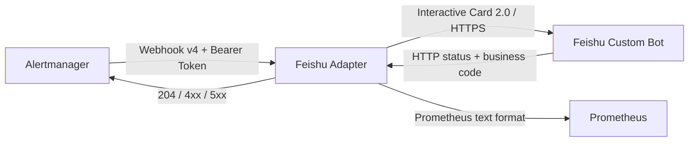

# Alertmanager Feishu Adapter

[](https://github.com/airsmon/alertmanager-feishu-adapter/actions/workflows/ci.yml)
[](https://go.dev/)
[](https://hub.docker.com/r/airsmon/alertmanager-feishu-adapter)

一个面向生产环境的轻量 Go 服务：接收 Alertmanager Generic Webhook v4，生成
飞书 Interactive Card 2.0，并通过飞书自定义机器人发送告警和恢复通知。

适配器不仅检查飞书 HTTP 状态码，还检查响应 JSON 中的业务码，避免把
“HTTP 200、业务失败”误判为投递成功。

## 功能特性

- 接收 Alertmanager Generic Webhook v4，支持 `firing` 和 `resolved`。
- 使用强类型 Go 结构生成 Card 2.0，确保 `schema` 编码为字符串 `"2.0"`。
- 根据级别设置标题颜色：`critical` 红色、`warning` 橙色、`info` 蓝色，恢复统一绿色。
- 展示 Pod、Node、Service、Instance、设备、工作负载、摘要、详情、持续时长和指纹。
- 将次要信息放入默认收起的 `collapsible_panel`，保持核心信息清晰。
- 仅渲染 HTTPS Dashboard/Runbook 链接，并中和动态文本中的飞书 `<at>` 语法。
- 使用 Bearer Token 保护告警入口；Webhook 和 Token 只从文件读取。
- 区分临时错误和永久错误，把正确的 HTTP 状态返回给 Alertmanager。
- 提供健康检查、就绪检查、Prometheus 指标和 JSON 结构化日志。
- 无状态运行，支持多副本；容器为无 Shell 的静态二进制并使用非 root 用户。

## 工作流程



适配器对飞书只执行一次请求，不在内部进行长时间重试：

- 飞书明确成功后向 Alertmanager 返回 `204`。
- 网络错误、HTTP 408/429/5xx 或未知业务错误返回 `503`，由 Alertmanager 重试。
- 无效告警或确定无法通过重试修复的请求返回 `422`。

这样可以避免适配器和 Alertmanager 同时重试造成重复卡片。

## 兼容性与当前限制

| 项目 | 当前行为 |
|---|---|
| Alertmanager Webhook | 只接受 `version: "4"` |
| 告警状态 | 只接受 `firing`、`resolved` |
| 每组告警数量 | 1–10 条；Alertmanager 应设置 `max_alerts: 10` |
| 请求体 | 最大 1 MiB，`Content-Type` 必须为 `application/json` |
| 飞书地址 | 仅接受 `https://open.feishu.cn` 自定义机器人地址 |
| 飞书机器人 | 每个适配器实例配置一个 Webhook |
| 卡片环境 | 当前默认为 `production / infra-01` |
| 时区 | 当前固定为 `Asia/Shanghai` |
| 交互能力 | 当前只负责发卡，不包含认领、静音和卡片回调 |
| 持久化 | 无本地数据库，分组、重试和去重由 Alertmanager 负责 |

JSON 中未知字段会被忽略，以兼容 Alertmanager 后续增加字段。每条告警必须包含
非零 `startsAt`；`resolved` 告警允许缺少 `endsAt`，以兼容上游实现差异。

## 快速开始

### 前置条件

- Go 1.25 或 Docker
- 一个飞书自定义机器人 Webhook
- Alertmanager（接入生产告警时）

### 获取并检查代码

```bash
git clone https://github.com/airsmon/alertmanager-feishu-adapter.git
cd alertmanager-feishu-adapter
make check
```

`make check` 会执行格式检查、`go vet`、竞态测试和静态构建。

### 本地运行

Secret 文件不要放入仓库。下面的示例将它们放在已被 `.gitignore` 忽略的目录中：

```bash
mkdir -p .secrets
chmod 700 .secrets

read -r -s -p "Feishu webhook URL: " FEISHU_WEBHOOK_URL
printf '%s' "$FEISHU_WEBHOOK_URL" > .secrets/feishu-webhook-url
unset FEISHU_WEBHOOK_URL

openssl rand -hex 32 > .secrets/adapter-token
chmod 600 .secrets/feishu-webhook-url .secrets/adapter-token

make build
FEISHU_WEBHOOK_FILE="$PWD/.secrets/feishu-webhook-url" \
ADAPTER_AUTH_TOKEN_FILE="$PWD/.secrets/adapter-token" \
./bin/adapter
```

另开一个终端检查服务：

```bash
curl -fsS http://127.0.0.1:8080/healthz
curl -fsS http://127.0.0.1:8080/readyz
curl -fsS http://127.0.0.1:8080/metrics
```

`/readyz` 表示进程已经开始监听，不会主动探测飞书网络或机器人状态。

## 配置

| 环境变量 | 默认值 | 说明 |
|---|---|---|
| `LISTEN_ADDRESS` | `:8080` | HTTP 监听地址 |
| `FEISHU_WEBHOOK_FILE` | `/var/run/secrets/feishu/webhook-url` | 飞书 Webhook 文件路径 |
| `ADAPTER_AUTH_TOKEN_FILE` | `/var/run/secrets/adapter-auth/token` | 告警入口 Bearer Token 文件路径 |
| `FEISHU_REQUEST_TIMEOUT` | `8s` | 单次飞书请求超时，必须为正数 |
| `SHUTDOWN_TIMEOUT` | `10s` | 优雅退出等待时间，必须为正数 |

Webhook 和 Token 不支持直接通过环境变量传入。Secret 文件只在进程启动时读取；
更新 Secret 后必须重启或滚动更新适配器。

## HTTP API

| 方法与路径 | 认证 | 用途 |
|---|---|---|
| `POST /api/v1/alertmanager` | Bearer Token | 接收 Alertmanager Webhook |
| `GET /healthz` | 无 | 进程存活检查 |
| `GET /readyz` | 无 | HTTP 服务就绪检查 |
| `GET /metrics` | 无 | Prometheus 指标 |

告警入口主要响应码：

| 状态码 | 含义 |
|---|---|
| `204` | 飞书已明确返回业务成功 |
| `400` | JSON 无效或请求包含多个 JSON 值 |
| `401` | Bearer Token 缺失或不匹配 |
| `413` | 请求体超过 1 MiB |
| `415` | `Content-Type` 不是 `application/json` |
| `422` | Alertmanager payload 不受支持，或飞书永久拒绝消息 |
| `503` | 飞书暂时不可用；响应包含 `Retry-After: 5` |

## Alertmanager 接入

适配器与 Alertmanager 必须读取同一个 Token。以下示例假设 Token 已挂载到
Alertmanager 的 `/etc/alertmanager/secrets/feishu-adapter-auth/token`：

```yaml
receivers:
  - name: feishu
    webhook_configs:
      - url: http://alertmanager-feishu-adapter.monitoring.svc.cluster.local:8080/api/v1/alertmanager
        send_resolved: true
        timeout: 10s
        max_alerts: 10
        http_config:
          authorization:
            type: Bearer
            credentials_file: /etc/alertmanager/secrets/feishu-adapter-auth/token
```

路由示例：

```yaml
route:
  receiver: "null"
  routes:
    - receiver: feishu
      matchers:
        - severity =~ "critical|warning|info"
```

使用 kube-prometheus-stack 时，可通过 Alertmanager CR 的 Secret 挂载能力提供文件：

```yaml
alertmanager:
  alertmanagerSpec:
    secrets:
      - feishu-adapter-auth
```

Helm 会整体替换部分数组。请把上述 receiver、route 和 Secret 合并到现有完整配置，
不要直接覆盖已有的 Watchdog、抑制规则或其他接收器。

## Kubernetes 部署

仓库提供以下 Kustomize 清单：

- `deploy/canary`：1 个副本，不创建 PDB。
- `deploy/final`：2 个副本，PDB `minAvailable: 1`。
- `deploy/base`：供覆盖层复用，镜像是故意不可用的占位值，不应单独部署。

清单假设命名空间为 `monitoring`，并使用以下 Secret：

```text
alertmanager-feishu-webhook/url
feishu-adapter-auth/token
```

建议从仓库外的受限文件创建 Secret：

```bash
kubectl create namespace monitoring --dry-run=client -o yaml | kubectl apply -f -

kubectl create secret generic alertmanager-feishu-webhook \
  --namespace monitoring \
  --from-file=url=/secure/path/feishu-webhook-url \
  --dry-run=client -o yaml | kubectl apply -f -

kubectl create secret generic feishu-adapter-auth \
  --namespace monitoring \
  --from-file=token=/secure/path/adapter-token \
  --dry-run=client -o yaml | kubectl apply -f -
```

先进行单副本验证：

```bash
kubectl apply -k deploy/canary
kubectl rollout status deployment/alertmanager-feishu-adapter \
  --namespace monitoring --timeout=5m
```

验证 firing 和 resolved 后切换到正式清单：

```bash
kubectl apply -k deploy/final
kubectl rollout status deployment/alertmanager-feishu-adapter \
  --namespace monitoring --timeout=5m
kubectl get deployment,pod,service,servicemonitor,pdb \
  --namespace monitoring \
  -l app.kubernetes.io/name=alertmanager-feishu-adapter
```

两个覆盖层都固定到 Docker Hub 的不可变镜像 digest。升级时应更新 digest，不要只使用
可覆盖的浮动 tag。

`ServiceMonitor` 依赖 Prometheus Operator CRD，并带有
`release: kube-prometheus-stack` 标签。使用其他 Prometheus 安装方式时，请按其
selector 修改该标签。如果镜像仓库改为私有仓库，还需要配置 `imagePullSecrets`。

Secret 更新后滚动重启：

```bash
kubectl rollout restart deployment/alertmanager-feishu-adapter --namespace monitoring
kubectl rollout status deployment/alertmanager-feishu-adapter \
  --namespace monitoring --timeout=5m
```

## 卡片内容

核心区域始终展示：

- 告警名称、状态、级别和命名空间
- 环境与集群
- Pod、Node、Service、Instance 或设备等告警对象
- 摘要、首次触发时间、恢复时间和持续时长

折叠区域按 labels 动态展示：

- 容器、工作负载、节点、Service、Endpoint、Job、Instance
- 数据中心、设备、机柜、通道、位置和电源相位
- description、完整 fingerprint、Dashboard 和 Runbook

安全处理：

- `summary` 最多 300 个 Unicode 字符，`description` 最多 500 个。
- 动态文本中的 `<at>`（不区分大小写）会转换为不可执行文本，避免意外 @ 人。
- Dashboard 和 Runbook 只接受无空白字符的 HTTPS URL。
- 日志只记录分组键短哈希，不记录告警正文、Webhook URL 或飞书响应正文。

## 可观测性

`/metrics` 输出固定低基数指标：

- `alertmanager_feishu_adapter_http_requests_total{code}`
- `alertmanager_feishu_adapter_delivery_attempts_total{result}`
- `alertmanager_feishu_adapter_delivery_duration_seconds_sum`
- `alertmanager_feishu_adapter_delivery_duration_seconds_count`
- `alertmanager_feishu_adapter_in_flight_requests`
- `alertmanager_feishu_adapter_last_success_timestamp_seconds`

应用日志以 JSON 写入 stderr。成功和失败日志包含结果、分组短哈希、状态、告警数量、
级别和耗时，不包含 Secret。

## 构建镜像

```bash
IMAGE=docker.io/airsmon/alertmanager-feishu-adapter:v0.1.0-20260722 \
  make image-amd64
docker push docker.io/airsmon/alertmanager-feishu-adapter:v0.1.0-20260722
```

当前已发布镜像：

```text
docker.io/airsmon/alertmanager-feishu-adapter:v0.1.0-20260722
docker.io/airsmon/alertmanager-feishu-adapter@sha256:6e390b239c51fe3a36cb96d2faaa56b20f305d32286ba4fa479015d8ae768a1e
```

Dockerfile 会在构建阶段运行测试，然后生成关闭 CGO、去除调试符号的静态二进制。
运行镜像基于 `scratch`，UID/GID 为 `65532:65532`。

## 开发

常用命令：

```bash
make fmt        # 格式化 Go 文件
make test       # 单元测试
make test-race  # 竞态测试
make vet        # 静态检查
make check      # 提交前完整检查
make build      # 构建 bin/adapter
make image      # 构建本机架构镜像
```

项目结构：

```text
cmd/adapter/          程序入口和优雅退出
internal/alertmanager Alertmanager v4 数据模型与校验
internal/card         飞书 Card 2.0 构造
internal/config       配置和 Secret 文件读取
internal/feishu       飞书客户端与错误分类
internal/httpapi      HTTP API、认证和状态码映射
internal/metrics      Prometheus 指标
deploy/               Kustomize 部署清单
testdata/             合成测试数据
```

GitHub Actions 会对 push 和 pull request 执行 module 校验、完整 Go 检查和 Docker 构建。

## 安全说明

- 飞书 Webhook 等同于发送凭据，不要提交到 Git、镜像、values 或日志。
- 告警入口使用常量时间 Token 比较；建议只通过 ClusterIP 暴露。
- `/healthz`、`/readyz` 和 `/metrics` 不要求认证。若改成 Ingress 或 LoadBalancer，
  必须增加网络策略、认证和访问控制。
- 生产环境应使用不可变镜像 digest、只读根文件系统、非 root 用户和最小权限。
- 适配器不会验证 Alertmanager 身份以外的签名；Bearer Token 应足够随机并定期轮换。

## 故障排查

- `401`：检查 Alertmanager 与适配器是否挂载了同一 Token。
- `415`：确认 Alertmanager 发送 `application/json`。
- `422`：检查 payload 版本、告警数量和适配器结构化日志中的数值错误码。
- `503`：检查飞书网络、限流和 `/metrics` 中的 `temporary_error`。
- 飞书无卡片但 Alertmanager 显示成功：确认请求实际经过适配器，并检查
  `delivery_attempts_total{result="success"}` 是否增长。

## 许可证

当前仓库尚未附带开源许可证。若计划公开分发或接受外部贡献，请先明确选择许可证。
